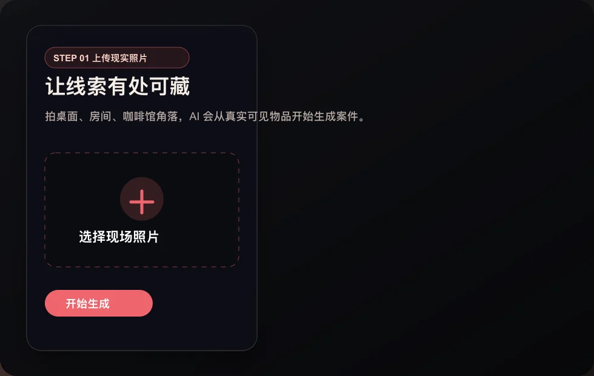
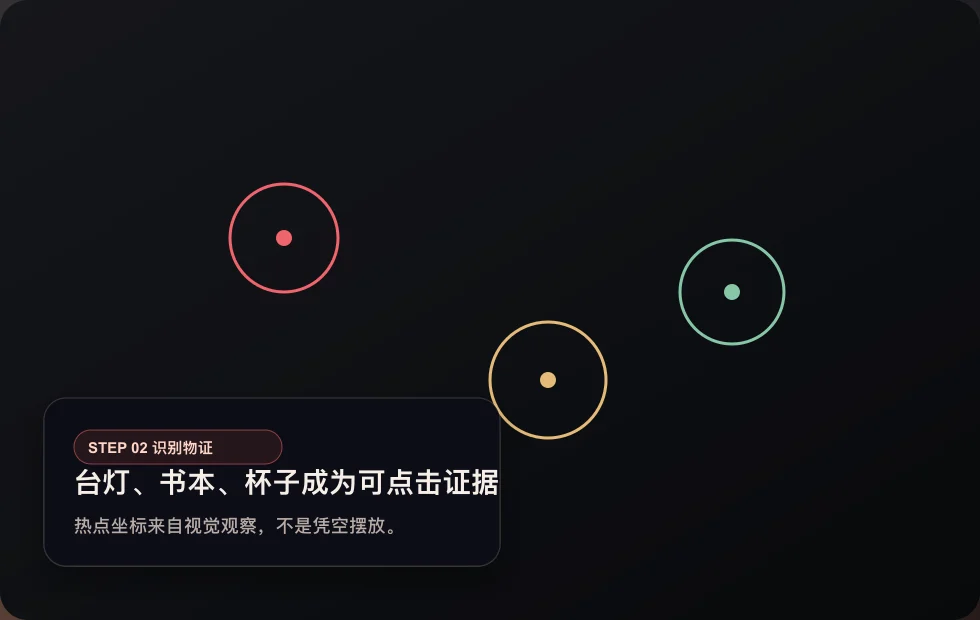
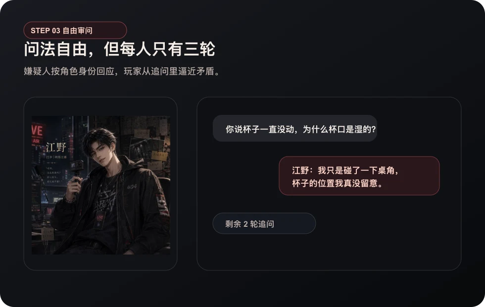
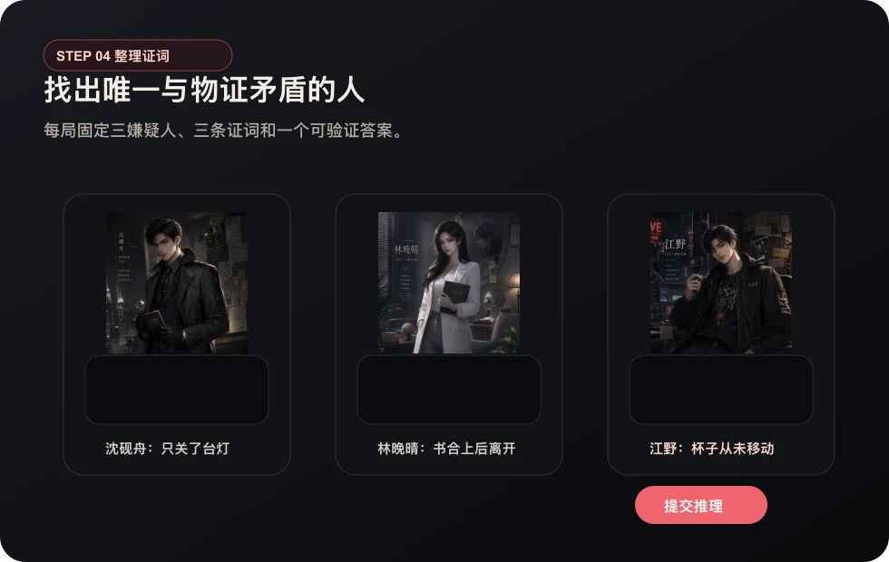
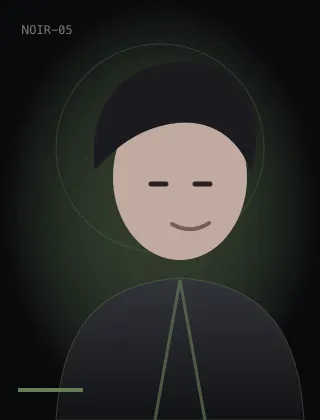
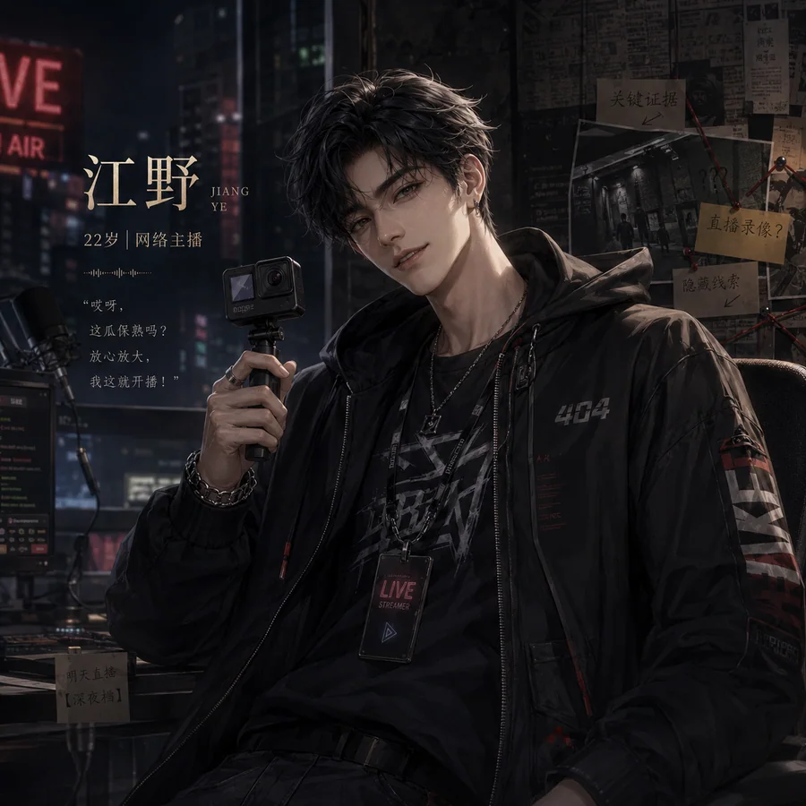
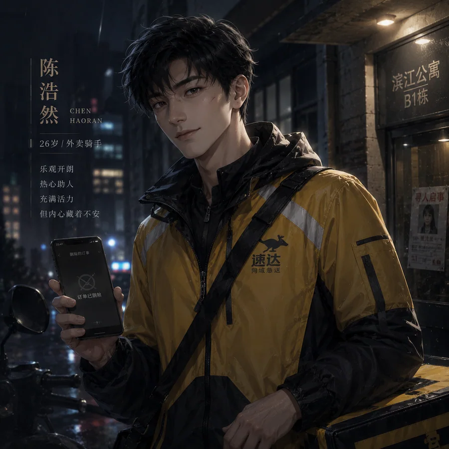
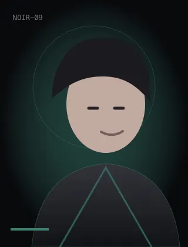

# 万物有戏

> 一款 AI Native 内容体验产品：上传一张现实空间照片，让 AI 把真实物品变成一场可探索、可审问、可推理的悬疑短局。

[在线体验](https://wanwuyouxi.xyz/) · [产品介绍页](https://wanwuyouxi.xyz/intro.html) · 建议使用手机打开



## 一句话

万物有戏不是“让 AI 写一个故事”，而是把现实照片变成一个完整互动闭环：

```text
现实照片 → 可见物品识别 → 物证热点 → 角色证词 → 唯一矛盾 → 真相揭晓
```

用户不需要学习 Prompt，只要拍下桌面、房间、咖啡馆角落或任何有可见物品的空间。系统会识别照片里的真实物件，把它们设计成案件物证，再生成三名嫌疑人和三份互相牵制的证词，让用户在几分钟内完成一局轻悬疑推理。

## 产品演示

| 1. 照片作为入口 | 2. 物证变成操作 |
| --- | --- |
|  |  |
| 用户从自己的现实空间开始，而不是从空白输入框开始。 | AI 识别出的物体会落到照片上，变成可以点击探索的热点。 |

| 3. 角色证词追问 | 4. 选择唯一矛盾 |
| --- | --- |
|  |  |
| 每个物证解锁一个角色，玩家可以围绕证词继续追问。 | 最终不是看故事，而是用物证和证词推出唯一矛盾。 |

## 核心体验

1. **上传真实照片**
   选择一张现实空间照片，系统会压缩并上传，进入“现场重建”状态。

2. **AI 识别可见物品**
   视觉模型只提取照片中清晰可见的物体、位置和状态，避免直接编造剧情。

3. **生成悬疑短局**
   案件生成模型基于结构化视觉事实，编译出三件物证、三名嫌疑人、三份证词和一个真相。

4. **点击照片探索**
   玩家在照片上点击物证热点，逐步解锁线索和嫌疑人角色卡。

5. **审问与推理**
   玩家可以对角色追问，再从三份证词中选择与现场物证矛盾的一项。

6. **揭晓真相**
   系统给出答案、动机与证据链，形成一次短、完整、有完成感的互动体验。

## 关键产品判断

### 为什么入口是“照片”

Prompt 对普通用户来说仍然有门槛，而且生成内容容易变成一次性阅读。照片把入口换成用户已经拥有的现实世界：桌上的杯子、墙角的灯、书页的折痕，都能成为“这是我的空间生成的案件”的惊喜点。

### 为什么选择悬疑推理

悬疑天然要求结构闭环：

```text
现场 → 物证 → 嫌疑人 → 证词矛盾 → 真相
```

这很适合验证 AI Native 产品的核心能力：AI 负责理解和创造，产品机制负责约束、一致性和可完成性。

### 为什么固定“三物证、三嫌疑人、一个矛盾”

首版不追求无限自由，而是优先保证用户能在三分钟左右完成一局。固定结构让模型输出可以被校验，也让玩家知道自己要找什么、什么时候可以结束。

### 为什么角色立绘采用预设池

项目设计了 21 个悬疑氛围角色立绘槽位，每局从角色池中选择三名嫌疑人。相比每次实时生成角色图，预设池更稳定、成本更低，也能保证 Demo 的视觉风格统一。

<p>
  
  
  
  
  
  
</p>

## AI 工作流

```text
真实照片
  ↓
Qwen Vision：提取可见物品、坐标、区域和视觉事实
  ↓
DeepSeek：把视觉事实编译成案件事实簿
  ↓
规则校验：检查字段、引用、坐标、答案唯一性
  ↓
语义校验：判断推理是否依赖照片外信息
  ↓
前端互动：探索、解锁、审问、选择、揭晓
```

看图和编故事被拆成两个阶段。剧情模型不直接接触原图，只能基于结构化视觉事实创作，减少幻觉，也更容易做失败兜底。

## 真实照片链路

真实照片上传是这个产品最重要的体验点，当前实现覆盖了从浏览器到模型生成的完整链路：

- 支持 JPEG、PNG、HEIC、HEIF；
- 浏览器侧压缩大图，避免真实手机照片过大导致上传失败；
- 上传前后都做图片类型和大小校验；
- 视觉识别失败时返回真实错误，不再静默伪装成示例案件；
- 视觉事实 ID 会在服务端统一规范，避免模型返回中文编号导致校验失败；
- 视觉识别默认等待时间加长，降低真实照片稍慢就超时的问题；
- 没有模型额度或网络不稳定时，可以用“体验示例案件”完成稳定演示。

## 已实现能力

- 移动端优先的首页、上传、生成、探索、推理、结果闭环；
- 真实照片生成案件，以及无需额度的示例案件；
- 三件物证逐一解锁三名嫌疑人；
- 嫌疑人角色卡与三轮自由追问；
- 三份证词选择、错误提示、二次机会和真相揭晓；
- 21 个悬疑角色立绘槽位；
- Qwen 多模态观察与 DeepSeek 案件编译；
- 规则校验、语义校验、失败兜底和自动化测试；
- Vercel 生产部署。

## 当前边界

- 首版重点验证“现实照片能否转成可玩的互动内容”，暂不做开放地图、长篇剧情和无限对话；
- 生成质量依赖照片清晰度、可见物体数量和模型响应稳定性；
- PGLite 数据库适合 Demo 和轻量演示，后续如果开放更多用户需要升级为生产级持久化数据库；
- 角色立绘是统一风格预设池，后续可以继续替换为更正式的商业视觉资产。

## 技术栈

- **应用框架：** Next.js、React、TypeScript
- **视觉理解：** Qwen Vision
- **案件生成：** DeepSeek
- **图片与存储：** 浏览器压缩、服务端校验、对象存储适配
- **测试：** Vitest、Testing Library、Playwright
- **部署：** Vercel

## 本地启动

```bash
pnpm install
cp .env.example .env.local
pnpm dev --hostname 127.0.0.1 --port 3100
```

打开 `http://127.0.0.1:3100`。未配置模型 API 时，可以直接点击“体验示例案件”完成稳定演示。

---

万物有戏想验证的是：当 AI 开始理解用户所在的现实世界，内容是否可以从“生成给你看”，变成“生成给你玩”。
