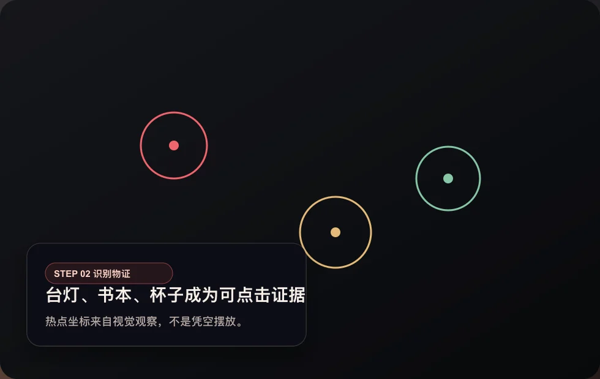
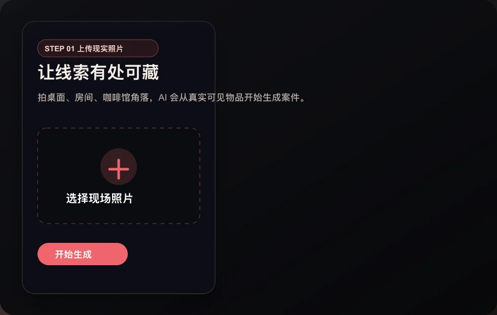
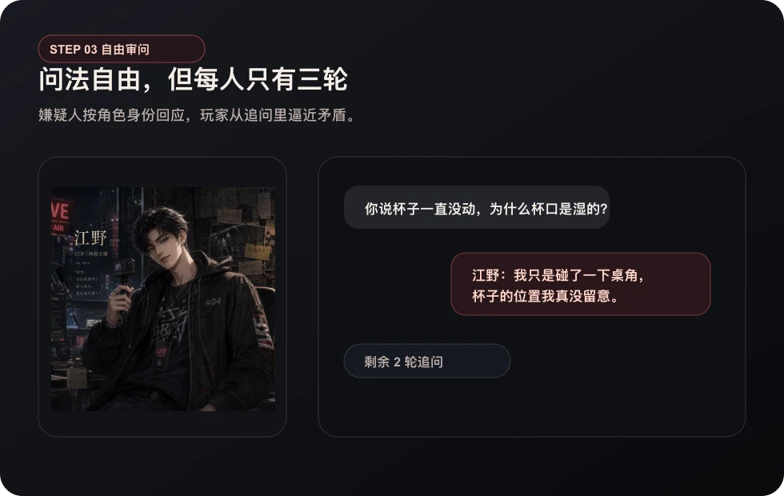
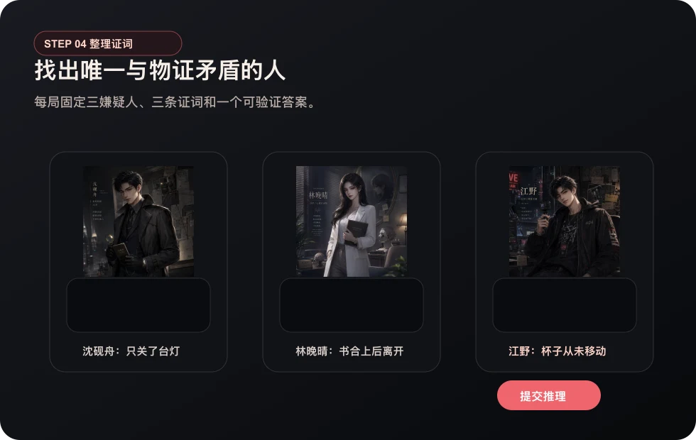
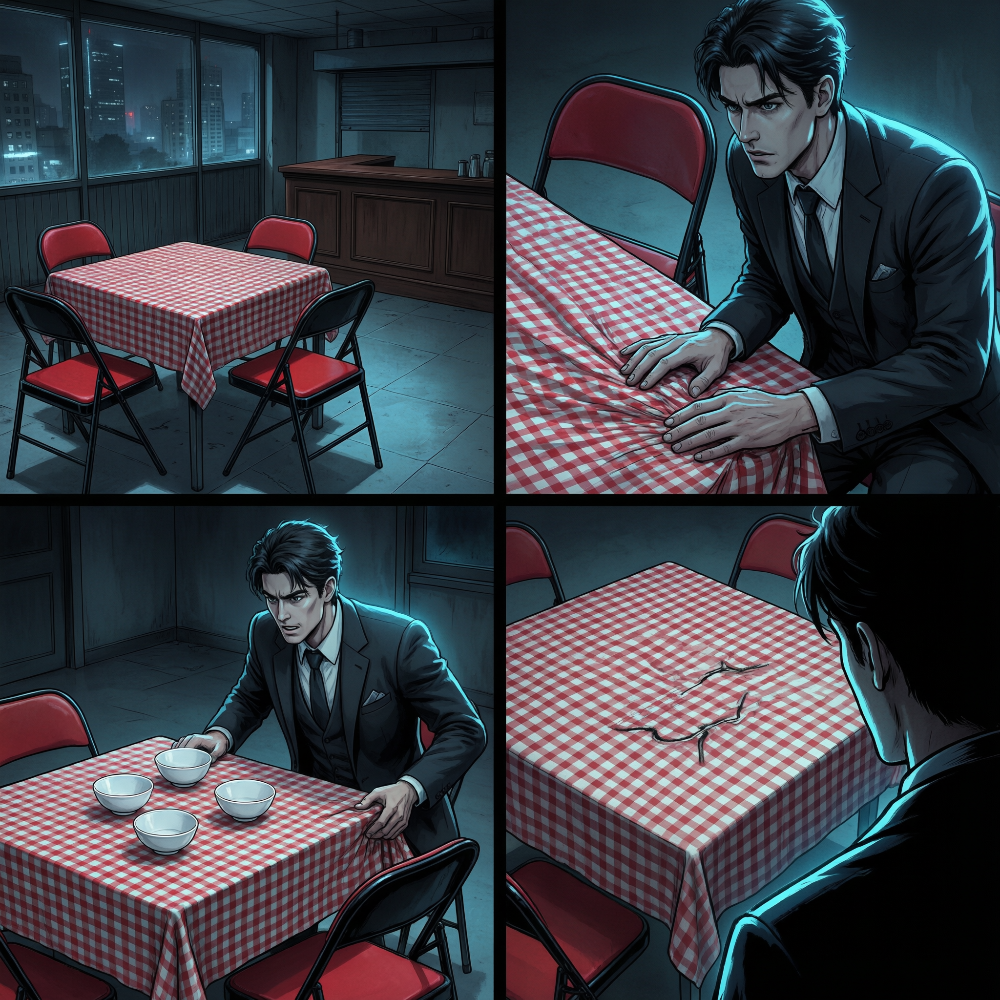
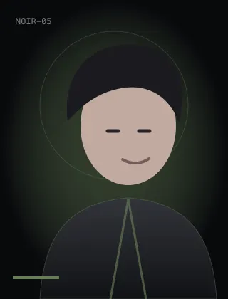
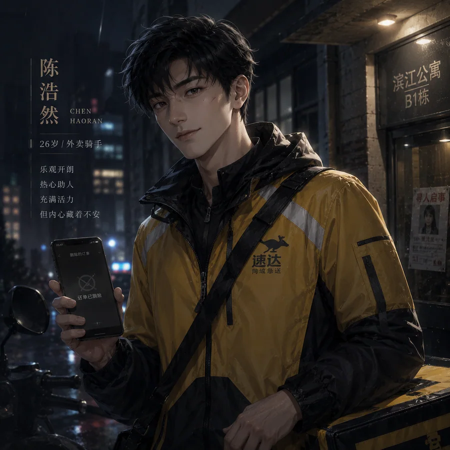
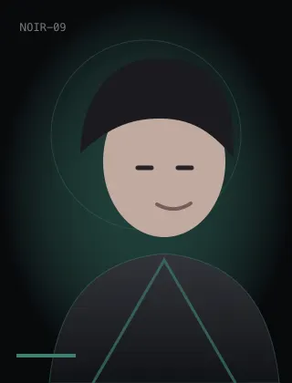

# 万物有戏

> 上传一张现实空间照片，让 AI 把真实物品变成一场可以探索、审问、推理，并生成漫画复盘的悬疑短局。

[在线体验](https://wanwuyouxi.xyz/) · [产品介绍页](https://wanwuyouxi.xyz/intro.html) · 建议使用手机打开



## 产品是什么

万物有戏不是让 AI 直接写一段悬疑故事，而是把用户身边的真实空间变成一个可玩的互动内容。

用户拍下一张桌面、房间、咖啡馆角落或任何有可见物品的照片。系统会识别照片里的物体，把它们设计成案件物证，再生成三名嫌疑人、三份证词和一个隐藏矛盾。玩家通过点击物证、追问角色、选择矛盾证词来破案，最后看到真相和四格漫画复盘。

```text
现实照片 → 物证热点 → 嫌疑人证词 → 自由追问 → 推理选择 → 真相漫画
```

## Demo 截图

| 照片即入口 | 物证可点击 |
| --- | --- |
|  |  |
| 不从空白输入框开始，而是从用户自己的现实空间开始。 | AI 识别出的物品会落到照片上，变成可以点击探索的热点。 |

| 审问嫌疑人 | 提交推理 |
| --- | --- |
|  |  |
| 每个物证会解锁一个角色，玩家可以围绕证词继续追问。 | 答案不是猜剧情，而是从物证和证词里找唯一矛盾。 |

| 真相复盘漫画 |
| --- |
|  |
| 破案后，系统把本局正确嫌疑人、关键物证和真相过程生成一张四格漫画，让结果可回看、可保存、可分享。 |

## 核心体验

1. **拍一张现实照片**
   用户上传真实空间照片，照片里的杯子、灯、书、椅子、房卡等物品都会成为潜在内容素材。

2. **把物品变成物证**
   系统提取可见物体、位置和状态，把它们转成可以点击的案件热点。

3. **生成一局短推理**
   每局固定三件物证、三名嫌疑人、一条核心矛盾，几分钟内可以完成。

4. **边探索边审问**
   玩家点击物证解锁角色，再围绕时间线、物证、证词进行追问。

5. **提交判断并看复盘**
   玩家选择最矛盾的证词，系统揭晓真相，并可生成案件四格漫画。

## 产品亮点

- **现实感强**：入口不是写 Prompt，而是用户眼前真实存在的空间。
- **可玩性强**：生成结果不是一段文本，而是被拆成热点、角色、证词、选择和反馈。
- **结构可控**：三物证、三嫌疑人、一个矛盾，让 AI 生成内容更容易被校验，也更容易玩完。
- **结果可沉淀**：真相档案和四格漫画让一次短局不仅有结论，也有可以保存的视觉结果。
- **视觉统一**：21 个悬疑角色立绘支撑角色气质、审问口吻和漫画参考。

## 角色系统

项目内置 21 个悬疑氛围角色。每局会从角色池中选择三名嫌疑人，保证 Demo 的视觉风格稳定，也让审问体验不只是临时生成的名字。

<p>
  
  
  
  
  
  
</p>

## 已实现

- 真实照片上传、压缩、校验和案件生成
- 无模型额度时可稳定体验的示例案件
- 图片物证热点、线索查看、嫌疑人解锁
- 三轮自由审问和证词选择
- 答案校验、错误提示、二次机会和真相揭晓
- 案件四格漫画生成与保存
- 21 个角色立绘池
- 移动端优先的完整交互流程
- Vercel 生产部署

## 当前边界

- 首版重点验证“现实照片能不能变成可玩的互动内容”，暂不做长篇剧情、开放地图和多人玩法。
- 生成质量会受照片清晰度、可见物体数量和模型稳定性影响。
- 角色立绘是统一风格预设池，后续可以继续替换为更正式的商业视觉资产。
- 当前数据库方案适合 Demo 和轻量演示，正式开放更多用户前需要升级持久化与运营后台。

## 技术概览

产品主体使用 Next.js、React 和 TypeScript。AI 链路分成两步：先用视觉模型提取照片里的可见事实，再用文本模型把结构化事实编译成案件。服务端会对案件字段、引用、坐标和答案唯一性做校验，减少生成内容失控。

## 本地启动

```bash
pnpm install
cp .env.example .env.local
pnpm dev --hostname 127.0.0.1 --port 3100
```

打开 `http://127.0.0.1:3100`。未配置模型 API 时，可以直接点击“体验示例案件”完成稳定演示。

---

万物有戏想验证的是：当 AI 开始理解用户所在的现实世界，内容是否可以从“生成给你看”，变成“生成给你玩”。
