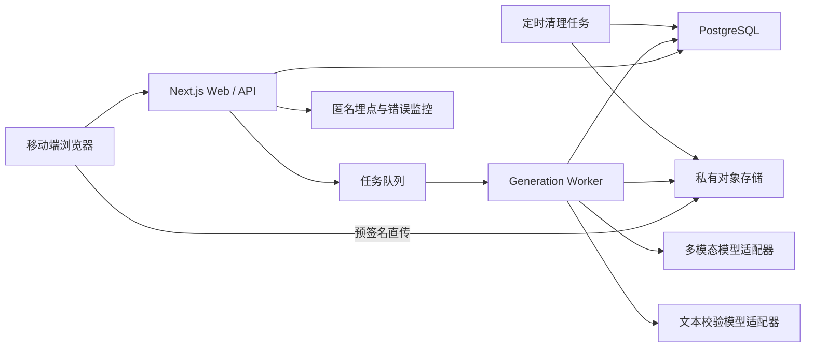

# 万物有戏 MVP 技术设计文档

> 版本：V1.0  
> 日期：2026-07-11  
> 状态：待技术评审  
> 需求来源：`docs/superpowers/specs/2026-07-11-wanwuyouxi-mvp-prd.md`

## 1. 文档目标

本文档将已确认的 PRD 转换为可实施的工程方案，供前端、后端和 AI 工作流开发使用。MVP 的技术目标不是实现通用 AI 游戏生成，而是稳定完成以下闭环：

1. 匿名用户上传一张现实空间照片；
2. 系统在 30 秒内完成安全检查、场景理解和案件生成；
3. 服务端只下发可玩且结构完整的固定题型；
4. 用户收集三个线索、最多答题两次并查看真相；
5. 页面刷新后可恢复，照片在 24 小时内删除；
6. 全链路可观察成本、延迟、失败原因和核心漏斗。

## 2. 核心技术决策

### 2.1 推荐技术栈

| 层级 | 推荐方案 | 原因 |
| --- | --- | --- |
| Web 应用 | Next.js App Router + TypeScript | 单仓库覆盖移动端页面和服务端接口，适合 2–3 周 MVP |
| UI | Tailwind CSS + 少量 CSS 动画 | 快速建立一致的移动端视觉；扫描和热点动画无需引入大型动画引擎 |
| 表单/状态 | React 本地状态 + TanStack Query | 服务端状态缓存、轮询和重试清晰；不引入全局状态库 |
| 数据校验 | Zod | 前后端共享 Schema，校验 AI 结构化输出 |
| 数据库 | PostgreSQL | 会话、任务、游戏状态、答题和埋点具备事务与唯一约束 |
| ORM | Prisma 或 Drizzle，二选一 | 首版只选一个；推荐 Prisma 以降低建模和迁移门槛 |
| 图片存储 | S3 兼容对象存储 | 支持预签名上传、生命周期删除和私有访问 |
| 异步任务 | 托管队列或数据库任务队列 | 避免浏览器请求阻塞 30 秒；支持重试、幂等和状态恢复 |
| AI 能力 | 支持视觉输入和 JSON Schema 输出的多模态模型 | 一次完成预检、物体理解与案件草案；供应商由适配层隔离 |
| 文本校验 | 低成本文本模型 | 仅检查谜题自洽性，不重复处理图片 |
| 埋点 | PostHog、Amplitude 或自建事件表，三选一 | MVP 推荐 PostHog；若合规或部署受限则使用自建事件表 |
| 错误监控 | Sentry 或等价服务 | 追踪前后端异常、接口耗时和任务失败 |
| 测试 | Vitest + Testing Library + Playwright | 单元、组件和移动端端到端测试完整覆盖 |

不在文档中锁定框架和 SDK 的具体小版本；实施时使用同一主版本下的当前稳定版本并提交锁文件。

### 2.2 架构原则

- **模块化单体优先**：一个 Web 仓库、一个数据库、一个对象存储和一个异步 Worker，不拆微服务。
- **异步生成**：上传完成后创建任务，前端轮询状态，不保持长连接请求。
- **服务端权威**：正确答案、答题次数、游戏状态和照片删除时间只由服务端维护。
- **不可变案件**：案件发布后内容不再调用模型或修改，游玩阶段完全确定性。
- **供应商隔离**：业务层依赖 `VisionGameProvider` 接口，不直接调用某个模型 SDK。
- **隐私最小化**：原图私有、短期保存、仅通过短时签名 URL 交给模型处理。

## 3. 系统架构



### 3.1 运行组件

1. **Web Client**：拍摄、压缩、上传、轮询、游戏交互、结果卡生成。
2. **BFF/API**：匿名会话、预签名、任务创建、状态查询、线索与答题接口。
3. **Generation Worker**：安全检查、场景理解、案件生成、确定性校验、语义校验和修复。
4. **PostgreSQL**：权威会话、任务、案件和玩家进度。
5. **Object Storage**：私有保存压缩后的 JPEG，按生命周期删除。
6. **Cleanup Job**：删除过期照片并将会话置为过期。

## 4. 推荐仓库结构

```text
src/
  app/
    page.tsx
    capture/page.tsx
    generate/[jobId]/page.tsx
    case/[caseId]/page.tsx
    case/[caseId]/deduction/page.tsx
    case/[caseId]/result/page.tsx
    privacy/page.tsx
    api/
      sessions/route.ts
      uploads/presign/route.ts
      generation-jobs/route.ts
      generation-jobs/[jobId]/route.ts
      cases/[caseId]/route.ts
      cases/[caseId]/clues/[clueId]/route.ts
      cases/[caseId]/answers/route.ts
      cases/[caseId]/delete-photo/route.ts
      analytics/route.ts
  features/
    capture/
      image-client.ts
      image-quality.ts
      capture-types.ts
    generation/
      generation-service.ts
      generation-worker.ts
      generation-state.ts
      provider.ts
      prompts.ts
    game/
      game-schema.ts
      game-validator.ts
      semantic-validator.ts
      hotspot-geometry.ts
      game-state.ts
    result-card/
      render-result-card.ts
    analytics/
      events.ts
      track.ts
  components/
    camera-guide.tsx
    scan-progress.tsx
    clue-hotspot.tsx
    clue-sheet.tsx
    answer-option.tsx
    error-state.tsx
  server/
    auth/anonymous-session.ts
    db.ts
    storage.ts
    queue.ts
    rate-limit.ts
    logger.ts
  db/
    schema.prisma
    migrations/
  tests/
    fixtures/
    unit/
    integration/
    e2e/
```

约束：`features` 内部可以依赖 `server` 和共享组件；路由只做鉴权、解析、调用服务和响应映射，不承载 AI Prompt 或业务校验。

## 5. 状态机

### 5.1 生成任务状态

```text
CREATED
  -> UPLOADED
  -> PRECHECKING
  -> ANALYZING
  -> DRAFTING
  -> VALIDATING
  -> REPAIRING     // 最多进入一次
  -> READY

任意处理中状态 -> RETRYABLE_FAILED
任意处理中状态 -> BLOCKED
任意处理中状态 -> EXPIRED
```

状态转换规则：

- 只有 Worker 可以写入处理中状态；
- API 使用数据库条件更新保证状态只能向前；
- `REPAIRING` 最多一次，由 `repair_count <= 1` 约束；
- 任务创建后 30 秒仍未 `READY`，前端显示超时，但 Worker 必须停止或丢弃迟到结果；
- `BLOCKED` 不保存案件草案；
- `READY` 后游戏内容不可变。

### 5.2 游戏状态

```text
BRIEFING -> EXPLORING -> DEDUCING -> REVEALED -> EXPIRED
```

- `BRIEFING`：已生成案件，尚未点击进入现场；
- `EXPLORING`：计时开始，可查看线索；
- `DEDUCING`：已查看三个线索；
- `REVEALED`：首次答对或第二次提交后揭晓；
- `EXPIRED`：照片和会话过期，不能继续游玩。

## 6. 数据模型

### 6.1 核心表

#### `anonymous_sessions`

| 字段 | 类型 | 说明 |
| --- | --- | --- |
| `id` | UUID | 内部主键 |
| `public_id` | string unique | 客户端不可猜测 ID |
| `created_at` | timestamp | 创建时间 |
| `expires_at` | timestamp | 会话过期时间 |
| `last_seen_at` | timestamp | 最近活动时间 |
| `status` | enum | `ACTIVE/EXPIRED/DELETED` |

#### `image_assets`

| 字段 | 类型 | 说明 |
| --- | --- | --- |
| `id` | UUID | 图片主键 |
| `session_id` | UUID FK | 所属匿名会话 |
| `storage_key` | string unique | 私有对象 Key，不返回日志 |
| `sha256` | string | 检测重复上传和幂等 |
| `width/height` | integer | 压缩后尺寸 |
| `bytes` | integer | 文件大小 |
| `mime_type` | string | 服务端只接受 JPEG |
| `status` | enum | `PENDING/UPLOADED/DELETED` |
| `delete_after` | timestamp | 最晚删除时间，默认上传后 24 小时 |
| `deleted_at` | timestamp nullable | 实际删除时间 |

#### `generation_jobs`

| 字段 | 类型 | 说明 |
| --- | --- | --- |
| `id` | UUID | 内部主键 |
| `public_id` | string unique | 前端查询 ID |
| `session_id` | UUID FK | 会话 |
| `image_asset_id` | UUID FK | 输入图片 |
| `idempotency_key` | string unique | 防止重复生成 |
| `status` | enum | 生成任务状态 |
| `stage` | string | 前端可显示的真实阶段 |
| `repair_count` | integer | 0 或 1 |
| `provider` | string | 模型供应商标识 |
| `model` | string | 模型标识 |
| `input_tokens/output_tokens` | integer nullable | 成本统计 |
| `error_code` | string nullable | 稳定错误码 |
| `started_at/completed_at` | timestamp nullable | 性能统计 |
| `expires_at` | timestamp | 迟到结果截止时间 |

#### `cases`

| 字段 | 类型 | 说明 |
| --- | --- | --- |
| `id` | UUID | 内部主键 |
| `public_id` | string unique | 客户端案件 ID |
| `session_id` | UUID FK | 所属会话 |
| `job_id` | UUID unique FK | 一次任务最多一个案件 |
| `image_asset_id` | UUID FK | 对应照片 |
| `title/background/objective` | text | 案件内容 |
| `question` | text | 最终问题 |
| `answer_options` | JSONB | 公开三选项 |
| `correct_answer_index` | smallint | 只在服务端返回逻辑中使用 |
| `wrong_answer_hint` | text | 首次错误提示 |
| `truth` | text | 揭晓后返回 |
| `interaction_mode` | enum | `HOTSPOT/CARD_FALLBACK` |
| `content_version` | integer | Schema 版本 |
| `created_at` | timestamp | 创建时间 |

#### `clues`

| 字段 | 类型 | 说明 |
| --- | --- | --- |
| `id` | UUID | 线索主键 |
| `case_id` | UUID FK | 所属案件 |
| `position` | smallint | 0–2，唯一约束 `(case_id, position)` |
| `object_name` | text | 物体名称 |
| `clue_text` | text | 线索内容 |
| `x/y/radius` | decimal | 归一化坐标 0–1 |
| `confidence` | decimal | 定位置信度 |
| `region_hint` | text | 30 秒无操作后的区域提示 |

#### `case_progress`

| 字段 | 类型 | 说明 |
| --- | --- | --- |
| `case_id` | UUID unique FK | 每案一条进度 |
| `session_id` | UUID FK | 所属会话 |
| `state` | enum | 游戏状态 |
| `opened_clue_ids` | UUID[] 或关联表 | 已收集线索 |
| `attempt_count` | smallint | 0–2 |
| `first_answer_correct` | boolean nullable | 首次是否答对 |
| `started_at/revealed_at` | timestamp nullable | 体验时长 |
| `version` | integer | 乐观锁，避免重复提交 |

### 6.2 数据约束

- `correct_answer_index BETWEEN 0 AND 2`；
- `attempt_count BETWEEN 0 AND 2`；
- `repair_count BETWEEN 0 AND 1`；
- `x/y BETWEEN 0 AND 1`；
- `radius BETWEEN 0.03 AND 0.12`；
- 每个案件严格三条线索；案件发布采用事务，一次写入案件、三条线索和初始进度；
- 客户端永远不接收 `correct_answer_index`，直到进入 `REVEALED`。

## 7. AI 输出 Schema

### 7.1 共享类型

```ts
type NormalizedPoint = {
  x: number;      // 0..1, relative to original image width
  y: number;      // 0..1, relative to original image height
  radius: number; // 0.03..0.12 of image short edge
};

type CandidateObject = {
  objectName: string;
  location: NormalizedPoint;
  locationConfidence: number; // 0..1
  safeForClue: boolean;
  containsSensitiveText: boolean;
};

type GeneratedClue = {
  objectName: string;
  location: NormalizedPoint;
  clueText: string;  // <= 50 Chinese characters
  regionHint: string; // <= 20 Chinese characters
};

type GeneratedCase = {
  schemaVersion: 1;
  precheck: {
    result: "PASS" | "RETRY" | "BLOCK";
    reasonCode:
      | "OK"
      | "TOO_DARK"
      | "TOO_BRIGHT"
      | "BLURRY"
      | "TOO_FEW_OBJECTS"
      | "NOT_REAL_SPACE"
      | "FACE_DOMINANT"
      | "SENSITIVE_TEXT"
      | "UNSAFE_CONTENT";
    userMessage: string;
    sceneType: "DESK" | "BEDROOM" | "DORM" | "OFFICE" | "CAFE" | "OTHER";
    qualityConfidence: number;
  };
  candidates: CandidateObject[];
  game: null | {
    title: string;            // <= 20 Chinese characters
    background: string;       // <= 80 Chinese characters
    objective: string;        // <= 40 Chinese characters
    clues: [GeneratedClue, GeneratedClue, GeneratedClue];
    question: string;         // <= 40 Chinese characters
    answerOptions: [string, string, string];
    correctAnswerIndex: 0 | 1 | 2;
    wrongAnswerHint: string;  // <= 30 Chinese characters
    truth: string;            // <= 120 Chinese characters
    confidence: number;
    riskLabels: string[];
  };
};
```

### 7.2 不变量

- `PASS` 时 `game` 必须非空；`RETRY/BLOCK` 时 `game` 必须为空；
- 三条线索物体名必须唯一，且必须出现在 `candidates`；
- `correctAnswerIndex` 指向一个唯一答案；
- 不得依赖照片中的小字、真实人物身份或照片外的关键证据；
- `riskLabels` 不允许命中暴力细节、色情、自残、仇恨、违法指导或真实人物犯罪指控；
- 任何不变量失败都不得发布案件。

## 8. AI 工作流

### 8.1 调用策略

MVP 推荐最多三次模型调用：

1. **多模态生成调用**：输入图片和固定 Schema，一次返回预检、候选物体和案件草案；
2. **文本语义校验调用**：只输入脱敏后的案件 JSON，判断是否自洽；
3. **定向修复调用，可选且最多一次**：只修复校验失败字段，不重新解释全部需求。

输入图片安全检测如果模型供应商提供独立审核能力，应在第 1 次调用前执行；若没有，则将严格安全分类放在第 1 次调用的前置结果中，并在输出端再次审核。

### 8.2 Provider 接口

```ts
interface VisionGameProvider {
  generateCase(input: {
    imageUrl: string; // short-lived signed URL
    imageWidth: number;
    imageHeight: number;
    locale: "zh-CN";
    traceId: string;
  }): Promise<GeneratedCase>;

  validateCase(input: {
    game: NonNullable<GeneratedCase["game"]>;
    visibleObjectNames: string[];
    traceId: string;
  }): Promise<SemanticValidation>;

  repairCase(input: {
    game: NonNullable<GeneratedCase["game"]>;
    issues: ValidationIssue[];
    traceId: string;
  }): Promise<NonNullable<GeneratedCase["game"]>>;
}
```

适配器负责模型 SDK、超时和供应商错误映射；业务层只处理统一类型。

### 8.3 Prompt 约束

系统 Prompt 只包含：

- 产品定位：轻悬疑、虚构、三分钟；
- 固定题型和长度限制；
- 物体与坐标规则；
- 禁止依赖小字、真实身份和照片外证据；
- 输出 Schema；
- 正确答案必须由三条线索共同支持；
- 错误答案可迷惑但不得同样成立；
- 不生成解释、Markdown 或 Schema 外字段。

用户输入不拼接任意文本，只有可信服务端生成的图片元数据和语言信息，降低 Prompt Injection 风险。

### 8.4 确定性校验顺序

1. JSON 解析和 Zod Schema；
2. 文本长度、枚举和重复值；
3. 坐标范围和半径；
4. 热点几何重叠；
5. 三条线索与候选物体绑定；
6. 唯一答案；
7. 敏感词和输出安全；
8. 语义模型校验；
9. 一次定向修复；
10. 重新执行 1–8；仍失败则任务失败或卡片模式降级。

### 8.5 热点重叠算法

将 `x/y` 视为归一化坐标，半径按图片短边换算。两个热点圆心距离小于两者半径之和的 `0.8` 倍时视为严重重叠。

```ts
function overlaps(a: NormalizedPoint, b: NormalizedPoint, aspect: number) {
  const dx = (a.x - b.x) * aspect;
  const dy = a.y - b.y;
  const distance = Math.sqrt(dx * dx + dy * dy);
  return distance < (a.radius + b.radius) * 0.8;
}
```

无法通过定位校验但故事语义合格时，将 `interaction_mode` 设置为 `CARD_FALLBACK`，前端使用三个物品卡片，不重新调用模型。

## 9. API 设计

所有接口返回：

```ts
type ApiResponse<T> =
  | { ok: true; data: T; traceId: string }
  | { ok: false; error: { code: string; message: string; retryable: boolean }; traceId: string };
```

### 9.1 创建匿名会话

`POST /api/sessions`

- 创建 HttpOnly、Secure、SameSite=Lax Cookie；
- 返回 `sessionPublicId` 和过期时间；
- 不采集姓名、邮箱或第三方账号。

### 9.2 获取上传地址

`POST /api/uploads/presign`

请求：

```json
{
  "sha256": "...",
  "width": 1200,
  "height": 900,
  "bytes": 842113,
  "mimeType": "image/jpeg"
}
```

响应包含 `imageAssetId`、一次性预签名上传地址和过期时间。服务端拒绝非 JPEG、超过 5 MB、尺寸低于最低阈值或元数据异常的请求。

### 9.3 创建生成任务

`POST /api/generation-jobs`

Headers：`Idempotency-Key: <uuid>`

请求：`{ "imageAssetId": "..." }`

响应：`{ "jobId": "...", "status": "CREATED" }`

服务端必须确认对象已上传、归属当前会话且未被删除。

### 9.4 查询生成任务

`GET /api/generation-jobs/:jobId`

响应只包含用户可理解的状态：

```json
{
  "status": "ANALYZING",
  "stage": "正在识别现场物品",
  "elapsedMs": 6400,
  "caseId": null,
  "failure": null
}
```

前端轮询：前 15 秒每 1 秒一次，15–30 秒每 2 秒一次；页面隐藏时暂停轮询，恢复时立即查询。

### 9.5 获取案件

`GET /api/cases/:caseId`

根据游戏状态返回不同字段：

- 揭晓前：不返回 `correctAnswerIndex` 和 `truth`；
- 首次答错前：不返回 `wrongAnswerHint`；
- `REVEALED` 后：返回完整真相和答题结果。

### 9.6 打开线索

`POST /api/cases/:caseId/clues/:clueId`

- 幂等；重复打开不增加计数；
- 使用数据库事务更新已打开线索；
- 第三个线索打开后将状态置为 `DEDUCING`；
- 响应返回当前已收集数量。

### 9.7 提交答案

`POST /api/cases/:caseId/answers`

请求：

```json
{
  "answerIndex": 1,
  "expectedVersion": 4
}
```

规则：

- 未收集三条线索返回 `GAME_NOT_READY`；
- 版本不一致返回最新进度，避免并发重复提交；
- 第一次错误返回提示，仍不返回正确答案；
- 首次正确或第二次提交后将状态置为 `REVEALED` 并返回真相；
- 第三次提交返回 `ATTEMPT_LIMIT_REACHED`。

### 9.8 删除照片

`DELETE /api/cases/:caseId/photo`

- 立即删除对象；
- 将 `image_assets.status` 更新为 `DELETED`；
- 案件文本和匿名进度可保留；
- 接口幂等。

## 10. 前端实现

### 10.1 图片管线

客户端步骤：

1. 使用文件签名和浏览器解码验证图片；
2. HEIC 在支持的客户端转换，失败则提示上传 JPEG/PNG；
3. 处理 EXIF 方向；
4. 使用 Canvas 或专用图片库缩放到最长边 1600 px；
5. 输出 JPEG，质量从 0.85 逐步降低，直至小于 5 MB；
6. 计算 SHA-256；
7. 请求预签名并直传对象存储；
8. 上传完成后创建生成任务。

客户端快速质量检查只用于即时提示，不作为安全决策。服务端和模型仍需执行权威预检。

### 10.2 坐标映射

照片使用 `object-fit: contain` 时，热点位置必须考虑 letterbox：

```ts
type RenderBox = { left: number; top: number; width: number; height: number };

function mapPoint(point: NormalizedPoint, box: RenderBox) {
  return {
    left: box.left + point.x * box.width,
    top: box.top + point.y * box.height,
    size: Math.min(box.width, box.height) * point.radius * 2,
  };
}
```

不得直接使用容器百分比定位，否则横竖图会产生偏移。

### 10.3 客户端恢复

- Cookie 保存匿名会话；
- `localStorage` 只保存最近 `jobId/caseId`，不保存案件答案和图片 URL；
- 刷新后先查询服务端状态，再恢复路由；
- 会话过期或照片已删除时清理本地引用并返回首页；
- 生成页离开后再次进入，继续查询同一任务，不重新创建任务。

### 10.4 结果卡

- 使用 DOM-to-image 或 Canvas 绘制固定 1080 × 1440 分享卡；
- 背景使用预设渐变、噪点和抽象色块，不使用清晰原图；
- 卡片包含案件标题、用时、是否首次答对和产品标识；
- 生成失败时不影响真相页，只隐藏保存按钮并允许重试。

## 11. 安全与隐私

### 11.1 上传安全

- 预签名只允许指定 Key、MIME 和大小；
- 对象存储 Bucket 默认私有，禁止公共读；
- 服务端在生成前重新校验实际文件头、尺寸和大小；
- 下载给模型的签名 URL 有效期不超过 5 分钟；
- 不接受客户端传入任意远程图片 URL，防止 SSRF；
- 每会话限制并发任务数为 1，每小时限制生成次数。

### 11.2 数据保护

- 日志只记录 `traceId/jobId/errorCode`，不记录 Base64、签名 URL、图片 Key、模型识别文本或完整案件；
- 数据库中的 `storage_key` 只在服务端使用；
- 原图默认 `delete_after = uploaded_at + 24h`；
- 清理任务至少每小时执行一次，并记录删除成功/失败计数；
- 删除失败进入单独重试队列，连续失败触发告警；
- 不将用户图片用于模型训练或内部数据集。

### 11.3 业务安全

- 输入和输出都执行安全检测；
- 发现真人时不得根据外貌推断身份、职业、健康、性取向或犯罪行为；
- Prompt 要求角色完全虚构；
- 用户不可提交自定义 Prompt；
- 模型输出在写库前进行 HTML 转义和控制字符过滤；
- 前端文本默认按纯文本渲染，不使用 `dangerouslySetInnerHTML`。

## 12. 错误码与用户降级

| 错误码 | HTTP | 可重试 | 用户处理 |
| --- | --- | --- | --- |
| `INVALID_IMAGE` | 400 | 否 | 重新选择 |
| `IMAGE_TOO_LARGE` | 413 | 否 | 客户端重新压缩 |
| `TOO_DARK/BLURRY/TOO_FEW_OBJECTS` | 422 | 否 | 按具体提示重拍 |
| `SENSITIVE_CONTENT` | 422 | 否 | 遮挡敏感内容后重拍 |
| `UNSAFE_CONTENT` | 403 | 否 | 阻止处理 |
| `RATE_LIMITED` | 429 | 是 | 稍后重试 |
| `MODEL_TIMEOUT` | 504 | 是一次 | 使用原图重试一次 |
| `INVALID_MODEL_OUTPUT` | 502 | 是一次 | 服务端定向修复 |
| `LOW_LOCATION_CONFIDENCE` | 200 | 否 | 使用卡片模式 |
| `SESSION_EXPIRED` | 410 | 否 | 返回首页重新拍摄 |
| `GAME_NOT_READY` | 409 | 否 | 继续收集线索 |
| `VERSION_CONFLICT` | 409 | 是 | 拉取最新进度 |

错误响应不得暴露模型供应商、Prompt、数据库异常或内部堆栈。

## 13. 可观察性与成本

### 13.1 Trace

每次体验生成一个 `traceId`，贯穿：

- 预签名请求；
- 对象上传完成；
- 任务入队和每个 Worker 阶段；
- 每次模型调用；
- 校验和修复；
- 案件发布；
- 前端错误上报。

### 13.2 指标

技术指标：

- `generation_total_duration_ms`；
- `model_call_duration_ms`；
- `generation_success_rate`；
- `repair_rate`；
- `card_fallback_rate`；
- `precheck_failure_rate_by_reason`；
- `model_tokens_per_case`；
- `estimated_cost_per_case`；
- `photo_delete_lag_minutes`。

业务漏斗沿用 PRD 事件，事件属性仅允许稳定枚举、耗时和计数，不包含用户内容。

### 13.3 成本护栏

- 每局多模态调用 1 次；
- 文本语义校验 1 次；
- 修复最多 1 次；
- 单任务设置最大输入图片尺寸和最大输出 Token；
- 达到日预算上限后停止新任务并显示维护状态；
- 将供应商原始用量记录为聚合指标，不保存完整请求正文。

## 14. 测试策略

### 14.1 单元测试

- `GeneratedCase` Schema 的合法与非法样本；
- 字符长度、重复答案、重复物体、坐标越界；
- 热点重叠和卡片模式降级；
- 状态机禁止倒退和二次修复；
- 第一次错误、第二次错误、首次正确三条答题路径；
- 坐标在横图、竖图和 letterbox 下的映射；
- 结果卡不包含清晰原图；
- 埋点 Payload 的敏感字段拒绝列表。

### 14.2 集成测试

- 预签名、上传确认、任务创建的完整流程；
- 同一个 `Idempotency-Key` 只产生一个任务；
- Worker 成功发布案件的事务；
- Worker 修复一次后成功或失败；
- 同时提交两个答案时只有一个事务成功；
- 刷新后恢复已打开线索；
- 删除照片接口和定时删除任务幂等；
- 模型超时、限流和非法 JSON 的错误映射。

### 14.3 AI 评测集

使用 PRD 规定的至少 50 张授权图片，并为每张建立人工标签：

- 是否应通过预检；
- 可作为线索的物体清单；
- 禁止物体或敏感区域；
- 合理热点大致区域；
- 预期失败原因。

自动计算：预检准确率、物体存在率、热点可接受率、Schema 成功率、修复率和平均成本。案件逻辑仍需人工评分。

### 14.4 端到端测试

至少覆盖：

1. 示例照片完成 Happy Path；
2. 第一次答错后第二次答对；
3. 过暗照片重拍；
4. 模型超时后重试；
5. 卡片模式降级；
6. 游戏中刷新恢复；
7. 移动端保存结果卡；
8. 会话过期返回首页。

## 15. 部署与环境

环境分为 `local/staging/production`：

- 每个环境使用独立数据库、Bucket 和模型密钥；
- Staging 使用低额度和测试 Bucket；
- Production 开启对象生命周期和预算告警；
- Secret 只存在于服务端和 Worker；
- 数据库迁移在部署前执行，失败则阻止发布；
- 上线前使用测试图片完成一次完整生成和删除验证。

必要环境变量：

```text
DATABASE_URL
OBJECT_STORAGE_ENDPOINT
OBJECT_STORAGE_BUCKET
OBJECT_STORAGE_ACCESS_KEY
OBJECT_STORAGE_SECRET_KEY
AI_PROVIDER
AI_API_KEY
AI_VISION_MODEL
AI_VALIDATION_MODEL
QUEUE_URL
ANALYTICS_KEY
SENTRY_DSN
PHOTO_TTL_HOURS=24
GENERATION_TIMEOUT_MS=30000
MAX_REPAIR_COUNT=1
```

## 16. 2–3 周实施顺序

### 第 1 周：确定性骨架

1. 初始化仓库、数据库迁移和环境配置；
2. 完成匿名会话、预签名上传和图片压缩；
3. 建立生成任务状态机和前端轮询；
4. 使用固定 Fixture 案件跑通介绍、热点、线索、答题和真相；
5. 完成服务端权威答题与刷新恢复。

退出标准：不接真实模型也能使用示例照片完整玩一局。

### 第 2 周：AI 工作流

1. 实现 Provider 接口和结构化输出；
2. 完成确定性校验、语义校验和一次修复；
3. 接入输入/输出安全检测；
4. 完成热点降级卡片模式；
5. 建立 50 张图片评测集并记录基线。

退出标准：授权图片的生成成功率达到可内测水平，非法案件不会发布。

### 第 3 周：精致度与验证

1. 完成扫描动画、等待状态、异常页面和结果卡；
2. 接入埋点、错误监控、成本和延迟指标；
3. 完成照片立即删除和定时清理；
4. 执行移动端兼容性与端到端测试；
5. 邀请 5 名用户走查，修复阻断问题；
6. 发布小范围测试并收集 20–50 名用户数据。

退出标准：满足 PRD 主流程验收条件，且不存在已知 P0/P1 缺陷。

## 17. 技术风险与取舍

| 风险 | 概率 | 影响 | MVP 对策 |
| --- | --- | --- | --- |
| 视觉模型坐标不稳定 | 高 | 高 | 容错光圈、归一化映射、卡片模式降级 |
| 谜题逻辑不唯一 | 中 | 高 | 固定题型、确定性校验、文本 Judge、一次修复 |
| 30 秒内无法完成 | 中 | 高 | 异步任务、单次视觉调用、图片压缩、迟到结果丢弃 |
| 隐私图片误留存 | 低 | 高 | Bucket 生命周期、定时任务、删除重试和告警 |
| 模型费用失控 | 中 | 中 | 固定调用次数、Token 上限、日预算熔断 |
| 微信内置浏览器能力差异 | 中 | 中 | 上传和分享降级，Staging 真机测试 |
| AI 内容出戏 | 高 | 中 | 短文本、照片物体强绑定、50 图评测和人工反馈 |

关键取舍：MVP 不追求轮廓级物体分割，也不保证每张照片都能生成；优先让失败可解释，让成功案件稳定可玩。

## 18. 技术验收清单

- [ ] 匿名用户无需登录可完成一局；
- [ ] 客户端输出 JPEG、最长边不超过 1600 px、文件不超过 5 MB；
- [ ] 上传采用私有对象和预签名 URL；
- [ ] 同一幂等键只产生一个生成任务；
- [ ] 任务状态单向变化，修复最多一次；
- [ ] 30 秒后停止等待并提供重试；
- [ ] 非法 Schema、重叠热点、非唯一答案不会发布；
- [ ] 定位低置信度进入卡片模式；
- [ ] 客户端在揭晓前无法获得正确答案；
- [ ] 每局最多提交两次答案；
- [ ] 刷新后恢复任务或游戏进度；
- [ ] 日志和埋点不包含照片、签名 URL 或内容原文；
- [ ] 原图可立即删除且默认 24 小时内自动删除；
- [ ] 示例案件具备稳定的端到端自动化测试；
- [ ] 50 张图片评测集产生成功率、修复率、热点可接受率和成本报告；
- [ ] Staging 完成一次真实生成、游玩和删除验证。

## 19. 待实施时确认的配置项

以下项目不改变架构，但应在开始编码前一次性选择并记录：

1. 部署平台；
2. PostgreSQL 与对象存储供应商；
3. 队列实现；
4. 主多模态模型和文本校验模型；
5. 埋点和错误监控服务；
6. 中国大陆网络环境是否为硬性要求。

若第 6 项为“是”，模型、对象存储、短信外的所有外部依赖都应在目标网络环境中进行真机可用性验证后再锁定。
